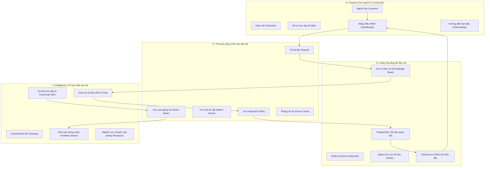

# Kiến trúc DX-OS / DX-Lab cho Học tập số
Dự án: **Học cùng Royce (quiz_study)** - OLP PMNM 2026

Tài liệu này trình bày cách thiết kế và chuyển đổi hệ thống **Học cùng Royce** thành một phòng thí nghiệm số **DX-Lab** phục vụ giáo dục thông minh và cá nhân hóa học tập, dựa trên mô hình kiến trúc **H-P-D-I** (Human - Process - Data - Intelligence) của chuyển đổi số (DX-OS).

---

---

## 1. H / Human (Con người & Tương tác)
Lớp này đóng vai trò giao tiếp, định danh người dùng và cá nhân hóa trải nghiệm cho các đối tượng tham gia học tập số.

*   **Các module/file hiện có trong mã nguồn**:
    *   Màn hình hướng dẫn ban đầu: [OnboardingPage.tsx](file:///c:/Users/199X/OneDrive/M%C3%A1y%20t%C3%ADnh/VOCA/English-level-up-tips/frontend/src/pages/OnboardingPage.tsx)
    *   Bảng điều khiển chính: [DashboardHomePage.tsx](file:///c:/Users/199X/OneDrive/M%C3%A1y%20t%C3%ADnh/VOCA/English-level-up-tips/frontend/src/pages/dashboard/DashboardHomePage.tsx)
    *   Quản lý thông tin hồ sơ: [ProfileEditPage.tsx](file:///c:/Users/199X/OneDrive/M%C3%A1y%20t%C3%ADnh/VOCA/English-level-up-tips/frontend/src/pages/dashboard/ProfileEditPage.tsx)
    *   Định danh backend: `backend/src/modules/users/`, `backend/src/modules/auth/`
*   **Kịch bản demo (Showcase Scenario)**:
    *   Học sinh mới đăng nhập bằng Google OAuth, giao diện Onboarding hiển thị chào mừng và hướng dẫn các công cụ AI. Trang Dashboard cá nhân hóa hiển thị danh sách từ vựng cần ôn trong ngày dựa trên lịch sử học tập.
*   **Hạn chế hiện tại (Gaps)**:
    *   Chưa phân quyền rõ ràng giữa vai trò "Giáo viên" (tạo học phần, kiểm soát lớp học) và "Học sinh" (học tập, làm quiz). Hiện tại mọi user đều có quyền giống nhau.
*   **Hướng phát triển cho OLP 2026**:
    *   Phát triển thêm phân hệ "Lớp học số" (Virtual Classroom) để giáo viên có thể giao bài tập flashcard và giám sát tiến độ của học sinh trực tiếp trên Dashboard.

---

## 2. P / Process (Quy trình học tập số)
Chuyển đổi các quy trình học tập truyền thống sang các quy trình số hóa tự động và tương tác cao.

*   **Các module/file hiện có trong mã nguồn**:
    *   Học phần & Flashcard: `backend/src/modules/content/`, `frontend/src/pages/dashboard/AddFlashcardPage.tsx`
    *   Phương pháp lặp lại ngắt quãng (SRS): `backend/src/modules/flashcards/` (Sử dụng thuật toán SM-2 để tính thời gian ôn tập tối ưu).
    *   Phương pháp giảng lại (Teach-Back): `backend/src/modules/teach-back/`, `frontend/src/pages/dashboard/TeachBackPage.tsx`
    *   Trò chơi trí nhớ (Match Game): `frontend/src/pages/dashboard/MatchGamePage.tsx`
*   **Kịch bản demo (Showcase Scenario)**:
    *   Học sinh tải lên slide bài giảng, quy trình AI tự động bóc tách văn bản và tạo bộ thẻ Flashcard. Khi học sinh học, thuật toán SRS sẽ tự động xếp lịch ôn tập thẻ đó vào 1 ngày, 3 ngày hoặc 7 ngày sau tùy thuộc vào mức độ nhớ bài.
*   **Hạn chế hiện tại (Gaps)**:
    *   Quy trình Teach-Back hiện tại chỉ cho phép học sinh nhập nội dung giảng giải bằng văn bản, chưa hỗ trợ thu âm trực tiếp (nói để AI đánh giá).
*   **Hướng phát triển cho OLP 2026**:
    *   Tích hợp thư viện ghi âm Web Audio API trên frontend để học sinh có thể nói trực tiếp câu trả lời của mình, sau đó chuyển giọng nói thành văn bản (Speech-to-Text) gửi lên AI đánh giá độ chính xác và phản xạ nói.

---

## 3. D / Data (Hạ tầng dữ liệu số)
Hạ tầng quản lý, phân tích và lưu trữ tri thức số đa chiều (Vector, Relational, Time-Series).

*   **Các module/file hiện có trong mã nguồn**:
    *   Cơ sở dữ liệu quan hệ (PostgreSQL): Lưu trữ thông tin tài khoản, thẻ học, tiến trình học. Thư mục `backend/migrations/` chứa lịch sử schema.
    *   Cơ sở dữ liệu Vector (Qdrant): Lưu trữ các đoạn nhúng dữ liệu (embeddings) để phục vụ cho tìm kiếm ngữ nghĩa và RAG Chat. Cấu hình tại `backend/src/modules/qdrant/`.
    *   Hệ thống phân tích tiến trình học (ClickHouse): Lưu trữ log học tập dạng chuỗi thời gian (time-series) để phân tích chi tiết tiến độ. Cấu hình tại `backend/src/modules/clickhouse/`.
    *   Bộ nhớ đệm & Hàng đợi (Redis): Cấu hình tại `backend/src/modules/redis/` và `backend/src/modules/queue/` để tối ưu hiệu năng và xử lý tác vụ nền (như import PDF lớn).
*   **Kịch bản demo (Showcase Scenario)**:
    *   Khi người dùng upload 1 cuốn sách PDF 100 trang, Redis nhận job đưa vào hàng đợi nền. Hệ thống bóc tách nội dung, sinh embeddings qua Gemini API rồi lưu vào Qdrant Vector DB. Mọi hành động click, lật thẻ được log về ClickHouse để vẽ biểu đồ phân tích tần suất học.
*   **Hạn chế hiện tại (Gaps)**:
    *   Kết nối Clickhouse và Qdrant hiện tại chưa hỗ trợ cơ chế sharding/clustering tự động cho các bộ dữ liệu siêu lớn.
*   **Hướng phát triển cho OLP 2026**:
    *   Cấu hình backup dữ liệu tự động sang cloud storage và bổ sung module phân tích dự báo điểm số học tập của học sinh dựa trên lịch sử hoạt động ghi nhận từ ClickHouse.

---

## 4. I / Intelligence (Trí tuệ nhân tạo AI)
Lớp thông minh tối ưu hóa quy trình học, đóng vai trò người gia sư ảo hướng dẫn học tập cá nhân hóa.

*   **Các module/file hiện có trong mã nguồn**:
    *   Cổng kết nối AI (AiService): Quản lý tích hợp Gemini và Grok API qua `backend/src/modules/ai/ai.service.ts`.
    *   Hỏi đáp thông minh (RAG Chat): Cho phép trò chuyện trực tiếp với tài liệu tải lên. Nằm tại `backend/src/modules/chat/`.
    *   Giải toán & Viết code (Problem Solver): `backend/src/modules/problem-solver/` (Sử dụng Grok/Gemini kết hợp Sandbox chạy code NodeJS/Python an toàn để giải bài tập).
    *   Nghiên cứu chuyên sâu (Deep Research): Tự động tìm kiếm, phân tích sâu rộng chủ đề học tập. Nằm tại `backend/src/modules/research/`.
    *   Lộ trình học tập sinh bởi AI (Learning Paths): Tạo bản đồ học tập từng bước cho người học tại `backend/src/modules/learning-paths/`.
*   **Kịch bản demo (Showcase Scenario)**:
    *   Học sinh nhập chủ đề "Lập trình hướng đối tượng với C++". AI tự động tạo một Learning Path gồm 5 chương. Học sinh nhấn vào chương 1 để bắt đầu chat với tút-tơ AI (RAG), sau đó làm bài tập lập trình và được AI chấm điểm, chạy thử code trong Sandbox.
*   **Hạn chế hiện tại (Gaps)**:
    *   Tính năng giải toán/code Sandbox chỉ hỗ trợ giới hạn một số thư viện cơ bản của Python và NodeJS, chưa có môi trường cô lập tuyệt đối cho các bài tập cấu trúc dữ liệu phức tạp.
*   **Hướng phát triển cho OLP 2026**:
    *   Phát triển hệ thống "AI Agent" tự động hóa việc chấm bài lập trình của học sinh bằng cách chạy testcase trong Docker container cô lập an toàn, trả về kết quả chi tiết từng testcase tương tự các hệ thống Online Judge (LeetCode/Codeforces).
